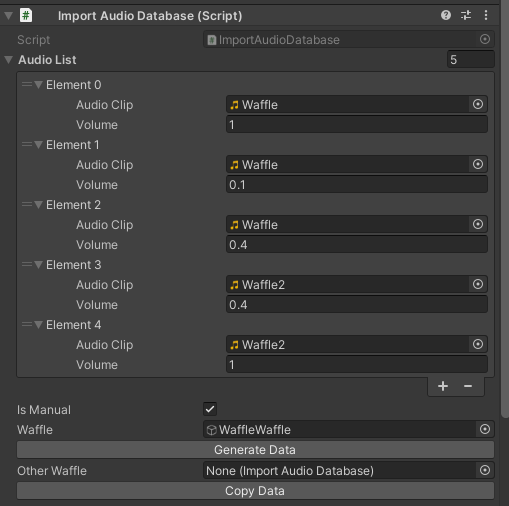
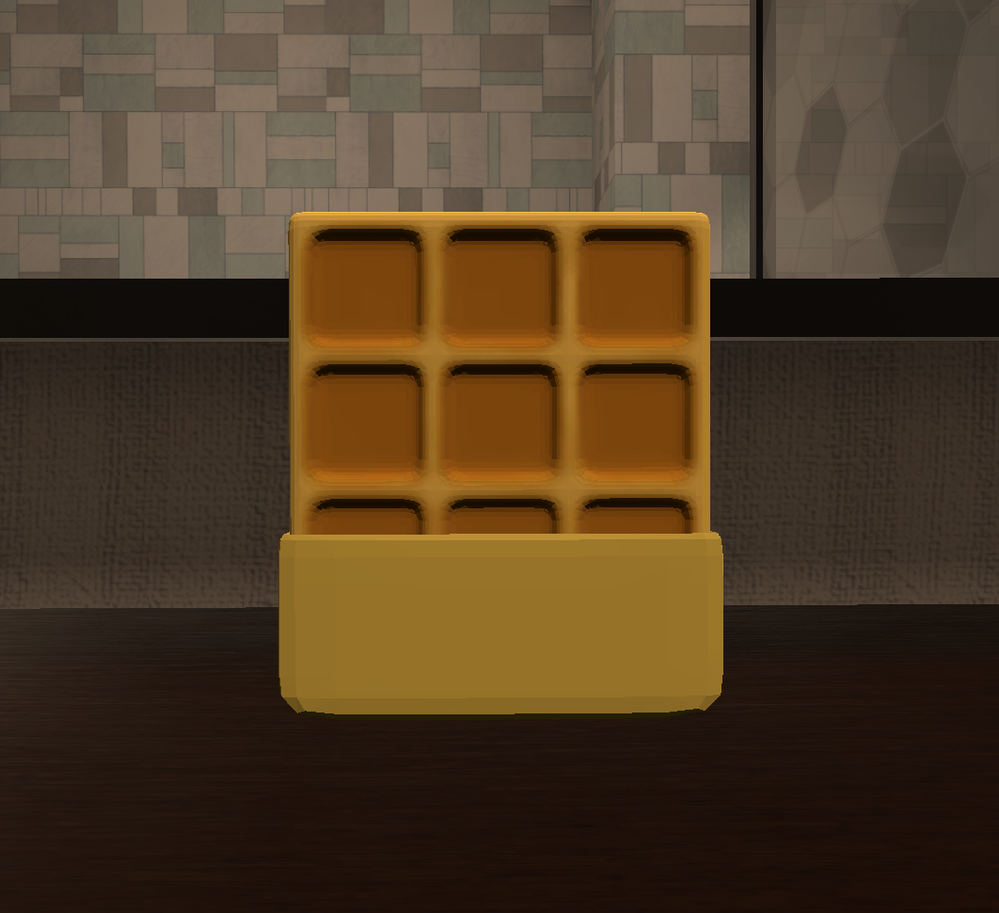

# Wafflewaffle

Wafflewaffle はVRChat Worldで使えるシンプルなランダムサウンドプレーヤーです。オーディオクリップ一つずつ音量が設定できますので、音量がバラバラでも簡単に修正できます。

A simple Udon random sound player for VRChat World with volume control

Beta-b9からStackOverflowの問題で導入ツールが削除されました。代わりにプレハブや新機能のCopy Dataをご利用ください。

From Beta-b9, the import tool is removed due to Stack Overflow issues. Please use the prefabs and the new function "Copy Data".

### 機能/Functions

Easy import / 導入が簡単

Volume Control / 音量調整

Global Object / グローバルオブジェクト

### 導入 / Import

2種類のPrefabがあります。StudioSaphir/Wafflewaffleのフォルダからプリハブを好きなところにD&Dします。Wafflewallfeは遅延で同期を確保する方法を利用する古いバージョンで、WafflewaffleManualは手動同期によって安定性が高くなっています。設定の手順はほぼ同じです。**データを正しく導入するために、PrefabをUnpackしてからご利用ください。**

There are 2 types of prefabs. In folder StudioSaphir/Wafflewaffle, drag the prefab to anywhere you want. Wafflewaffle is the older version that rely on delays to make sure the value is synced, while the WafflewaffleManual uses manual syncing and is more reliable. The process to import is roughly the same.**Please unpack the prefab before using this asset. Or the data won't be correctly generated.**

シーンにあるWaffleまたはWaffleManualを開き、サウンドを追加して音量(0~1)を設定します。設定が終わりましたら、Importをクリックします。**この作業は毎回編集する時に必要となります。**

Inside the Waffle Object, add your sound and volume (0~1) and click Import. **This process MUST be performed every time you edit the Waffle.**

これで完成です。WaffleのUdonBehaviorに導入されたデータが表示されます。（Manualバージョンでは子オブジェクトのUdonBehaviorにあります）

Now it's finished. You can use inspector to see imported values in the udon behavior. (The udon behavior for Manual varient is inside the wafflewaffle child object)

他のWaffleにデータをコピーする場合では、ペースト先のWaffleをOther Waffleに入れて（保存されないため、毎回入れ直す必要があります）、Copy Dataをクリックするとできます。

To copy your data to other waffles, please put the other waffle to the Other Waffle field (This won't be saved, so you need to put the other waffle every time you want to copy data), and click "Copy Data".

<!-- ### Change 3D Model/モデルの変更

Change Mesh in Mesh Filter and Materials in Mesh Renderers in inspector, resize the collider and you are good to go.

InspectorのMesh FilterでMeshを、Mesh Rendererでマテリアルを変更し、コライダーのサイズを調整すれば完成です。 -->

### If there are any issues, please post in the Issues page.

### もし問題がありましたら、Issuesに書いていただけると助かります。

<!-- ### (非推奨 / Not Recommended)導入ツールを利用する / Use the import tool

**UIToolkitのバグより、2つ以上のアイテムを連続に追加するとUnityがフリーズ、または落ちる可能性があります。必ず前のアイテムに何かを入力してから次のアイテムを追加してください。**

**Because of a bug in UIToolkit, adding more than 1 item at once may cause Unity to freeze or crash. FILL THE LAST THING YOU ADDED BEFORE ADDING ANOTHER ITEM**

Download and import unitypackage from release page. 

リリースページでunitypackageをダウンロードし導入します。
 

In folder StudioSaphir/Wafflewaffle, drag the prefab to anywhere you want. Wafflewaffle is the older version that rely on delays to make sure the value is synced, while the WafflewaffleManual uses manual syncing and is more reliable.

StudioSaphir/Wafflewaffleのフォルダからプリハブを好きなところにD&Dします。Wafflewallfeは遅延で同期を確保する方法を利用する古いバージョンで、WafflewaffleManualは手動同期によって安定性が高くなっています。
 

In the toolbar Tools/StudioSaphir/WaffleImport, set the Waffle inside and Click Reload. You need to do this every time you edit your waffle.

ツールバーのTools/StudioSaphir/WaffleImportにさっきのWaffleを入れて、Reloadをクリックします。この作業は毎回編集する時に必要となります。
 

Add your sound and volume (0~1) and click Import. 

サウンドを追加して音量(0~1)を設定します。設定が終わりましたら、Importをクリックします。
 

Now it's finished. You can use inspector to see imported values. (The udon behavior for Manual varient is inside the wafflewaffle child object) Cross-importing data from/to both varient is also supported.

これで完成です。WaffleのInspectorで導入されたデータが見れます。（Manualバージョンでは子オブジェクトのUdonBehaviorにあります）WafflewaffleからManualバージョンのデータ導入とその逆方向の導入も同じ手順でできます。
 -->