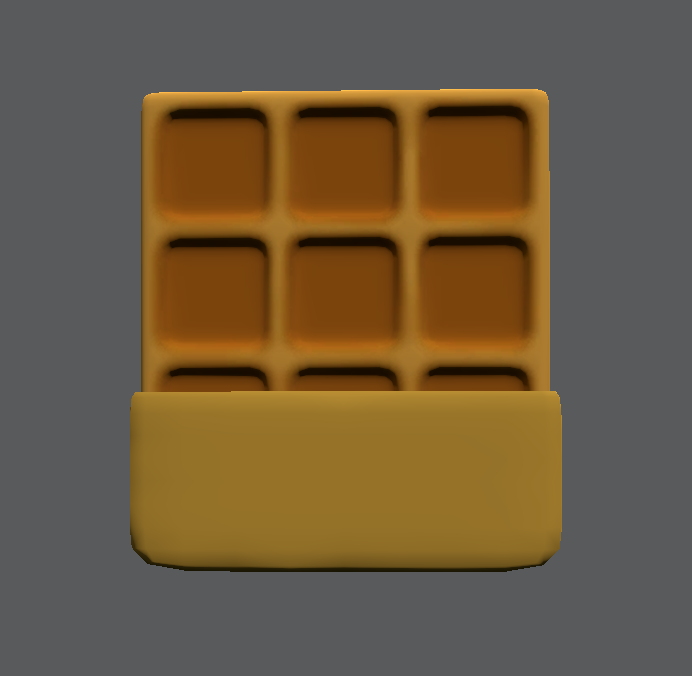

# Wafflewaffle

Wafflewaffle はVRChat Worldで使えるシンプルなランダムサウンドプレーヤーです。オーディオクリップ一つずつ音量が設定できますので、音量がバラバラでも簡単に修正できます。

ワッフルとして食べられる（Useできる）機能も搭載しました。

A simple Udon random sound player for VRChat World with volume control

Eating(Using) is also available now

Beta-b9からStackOverflowの問題で導入ツールが削除されました。代わりにプレハブや新機能のCopy Dataをご利用ください。

From Beta-b9, the import tool is removed due to Stack Overflow issues. Please use the prefabs and the new function "Copy Data".

### 特徴/Functions

Easy import / 簡単導入

Volume Control / 音量調整

Global Sync / グローバル同期

### 導入 / Import

2種類のPrefabがあります。StudioSaphir/Wafflewaffleのフォルダからプリハブを好きなところにD&Dします。Wafflewallfeはランダムサウンドを出すオブジェクトで、設定する必要がありますが、WaffleEatはそのままUseすると食べるサウンドとパーティクルが発生します。**データを正しく導入するために、PrefabをUnpackしてからご利用ください。**

There are 2 types of prefabs. In folder StudioSaphir/Wafflewaffle, drag the prefab to anywhere you want. Wafflewaffle is the random sound player that requires user setup, and WaffleEat is a waffle object that plays a biting sound and shows some particles when being used. Waffle Eat can be used without following steps.**Please unpack the prefab before using this asset. Or the data won't be correctly generated.**

シーンにあるWaffleを開き、サウンドを追加して音量(0~1)を設定します。Do Eatを有効にすると、Useするとパーティクルが生成されます。Allow Interruptionをオンにすると、音が流されていてもUseすると中断して次の音を流すようになります。設定が終わりましたら、Importをクリックします。**この作業は毎回編集する時に必要となります。**

Inside the Waffle Object, add your sound and volume (0~1) and click Import. Enabling Do Eat will show eating particles when the sound is played. By turnning on Allow Interruption, using the object while the sound is playing will end the current sound and the next sound will be played. **This process MUST be performed every time you edit the Waffle.**

これで完成です。Waffleの子オブジェクトにあるUdonBehaviorに導入されたデータが表示されます。

Now it's finished. You can use inspector to see imported values in the udon behavior in the child object.

他のWaffleにデータをコピーする場合では、ペースト先のWaffleをTarget Waffleに入れて（ここのターゲットは保存されないため、毎回入れ直す必要があります）、Copy Dataをクリックするとできます。

To copy your data to other waffles, please put the other waffle to the Target Waffle field (This won't be saved, so you need to put the other waffle every time you want to copy data), and click "Copy Data".

<!-- ### Change 3D Model/モデルの変更

Change Mesh in Mesh Filter and Materials in Mesh Renderers in inspector, resize the collider and you are good to go.

InspectorのMesh FilterでMeshを、Mesh Rendererでマテリアルを変更し、コライダーのサイズを調整すれば完成です。 -->

### If there are any issues, please post in the Issues page.

### もし問題がありましたら、Issuesに書いていただけると助かります。