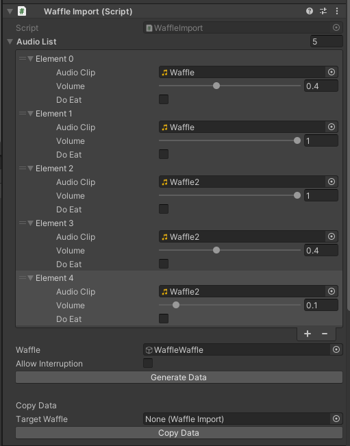

# Wafflewaffle

A simple Udon random sound player for VRChat World with volume control

Wafflewaffle はVRChat Worldで使えるシンプルなランダムサウンドプレーヤーです。サウンドトラック一つずつ音量が設定できますので、音量がバラバラになっても修正が簡単にできます。

> ALPHA VERSION: SYNC FUNCTION **NOT TESTED**

> ALPHAバージョン：同期機能は**テストされておりません。**

### Functions/機能

Easy import / 導入ツール付き

Volume Control / 音量調整

Global object / グローバルオブジェクトです

### Import/導入

Download and import unitypackage from release page. 

リリースページでunitypackageをダウンロードし導入します。
 

In folder StudioSaphir/Wafflewaffle, drag the prefab to anywhere you want. 

StudioSaphir/Wafflewaffleのフォルダからプリハブを好きなところにD&Dします。
 

In the toolbar /StudioSaphir/WaffleImport, set the Waffle inside and Click Reload. You need to do this every time you edit your waffle.

ツールバーの/StudioSaphir/WaffleImportにさっきのWaffleを入れて、Reloadをクリックします。この作業は毎回編集する時に必要となります。
 

Add your sound and volume (0~1) and click Import.

サウンドを追加して音量を設定します(0~1)。設定が終わりましたら、Importをクリックします。
 

Now it's finished. You can use inspector to see imported values.

これで完成です。WaffleのInspectorで導入されたデータが見れます。

### Change 3D Model/モデルの変更

Change Mesh in Mesh Filter and Materials in Mesh Renderers in inspector, resize the collider and you are good to go.

InspectorのMesh FilterでMeshを、Mesh Rendererでマテリアルを変更し、コライダーのサイズを調整すれば完成です。

### If there are any issues, please post in the Issues page.

### もし問題がありましたら、Issuesに書いていただけると助かります。